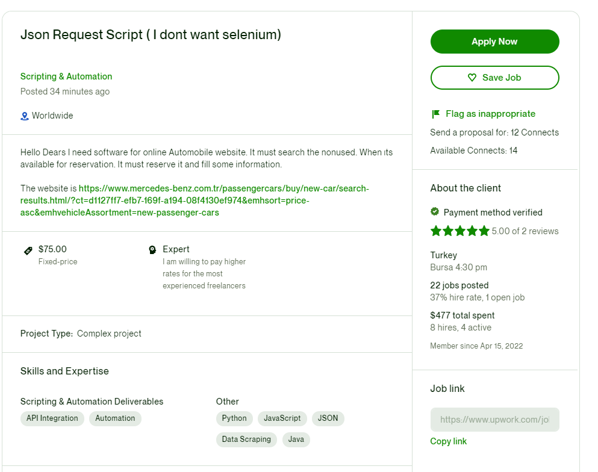

# BAB 4: Contoh Analisa Job Data Scraping

---

Pada bab ini kita akan belajar membaca jobdesk dari client khususnya dalam dunia freelance ya, kita akan ambil dari upwork, contoh kasusnya seperti ini

disini kita akan bedah contoh jobdesk data scraper yang ada dalam real world, kita akan ambil dari upwork.com

berikut adalah contoh job yang akan kita analisa, dari job ini kita dapat beberapa kesimpulan yaitu

URL yang di scrape: https://www.mercedes-benz.com.tr/passengercars/buy/new-car/search-results.html/?ct=d1127ff7-efb7-169f-a194-08f4130ef974&emhsort=price-asc&emhvehicleAssortment=new-passenger-cars

JOBDESK UTAMA

> I need software for online Automobile website. It must search the nonused. When ıts available for reservation. It must reserve it and fill some information.

nah disini itu bisa dilihat bahwa jobdesk tersebut sedikit kurang jelas, hal yang perlu kita ketahui sebelum mengerjakan scraping

>  **Usahakan Bahwa Jobdesk nya sudah jelas dan Clear di awal** 

supaya nanti kita bisa fokus mengerjakan task yang diberikan dan tidak ada problem non teknis sebelum payment,

untuk menghindari cancel job dan beberapa kemungkinan kita tidak dibayar karena alasan task job tidak jelas atau tidak clear diawal

### Proses Analisa Job

disini kita analisa job nya 

* URL yang di scrape: https://www.mercedes-benz.com.tr/passengercars/buy/new-car/search-results.html/?ct=d1127ff7-efb7-169f-a194-08f4130ef974&emhsort=price-asc&emhvehicleAssortment=new-passenger-cars
* Fitur Search dan Autofill
* Filter Reservasi
  * Analisa Kemungkinan
    * Menjadi Sebuah Web/API
    * Fitur scheduler
    * Menjadi Sebuah File Excel atau CSV yang bisa didownload

nah disini kita sudah analisa beberapa kemungkinan yang akan diminta oleh client berdasarkan apa yang kita pelajari pada chapter chapter sebelumnya, nah pada chapter selanjutnya kita akan mencoba untuk studi kasus membuat ecomerce Scraper nike.com, kemudian kita akan mengerjakan situs ini sebagai studi kasus kedua.

---
