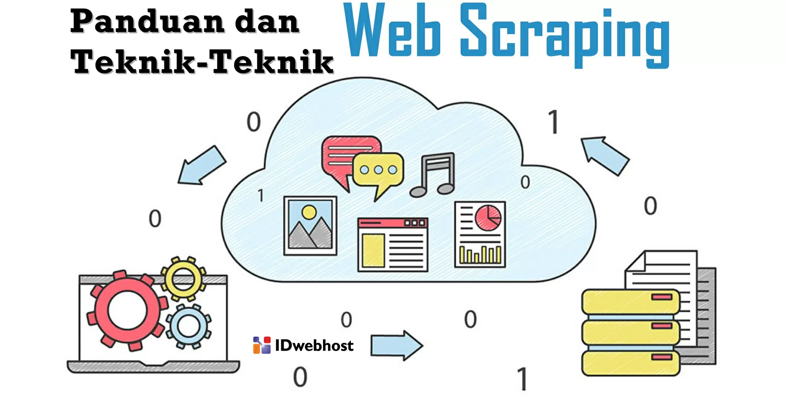

# BAB 1: Kenalan dengan Scraping

---

Disini saya ngga akan bahas dari sejarah ataupun asal usul tapi dari data scraping itu ngapain sih kok bisa dinamakan data scraping, kita akan mulai dari dasar dulu

### Scraping itu Ngapain?

Pernah denger ngga orang lagi copy paste data dari suatu sumber lalu dibuat sebagai laporan yang enak dibaca? atau dijadikan data yang rapi dan sudah diolah kemudian dipake untuk keperluan tertentu, misalnya buat analisis data produk atau pasar, keperluan pendidikan dan pendataan  dan lainya?

iya itu adalah **data Entry** nah kok bisa bahas data entry sih? bukan data scraping, sebenernya data scraping dan data entry itu hampir sama tetapi data scraping itu prosesnya bukan copy paste manual layaknya **Data Entry** namun lebih di otomatisasi menggunakan bahasa  pemrograman tertentu

misalnya python, namun jika kita lihat secara proses kurang lebih hampir mirip.

### Scraping dan Cara Kerjanya

Sekarang kok bisa beda ya antara data scraping dan data entry padahal tujuan nya sama ya itu membuat data report agar bisa dibaca dan digunakan ke berbagai keperluan. berikut adalah cara kerjanya



disini kita akan bedah satu persatu mengapa prosesnya seperti itu

### Bagaimana Proses Data Scraping itu Terjadi?

proses pertama yang akan kita pelajari adalah dari mana sumber data itu berasal, kemudian apa saja data yang diperlukan, dan buat apa data itu digunakan mari kita bahas

#### Dari mana Sumber Data itu berasal

pada step pertama kita harus tau darimana data tersebut berasal, ada beberapa hal yang perlu menjadi perhatian kita untuk melakukan scraping, itu kita harus tahu darimana sumber data yang akan kita scrape, penyebutan scraping di berbagai negara pun beragam, hal ini dapat kita lihat dari sumber datanya darimana, misalnya, jika sumber datanya dari web maka disebut **web scraping** jika sumber datanya dari api maka disebut **API Scraping** jika ngga dari keduanya maka biasa disebut **Scraping.**

karena dari step pertama kita dapat menganalisis bagaimana langkah selanjutnya akan diambil, misalnya jika kita mau scraping yang sumbernya dari web `quotestoscrape.com` nah kita bisa simpulkakn bahwa step selanjutnya adalah menentukan tools apa yang akan digunakan untuk melakukan scraping pada web, rekomendasi tools yang biasa digunakan untuk scraping web menggunakan python adalah `requests` dan `BeautifulSoup4` contoh kecilnya seperti ini

```python
import requests
from bs4 import BeautifulSoup

# web yang akan di scraping
url: str = "https://quotes.toscrape.com/"
res = requests.get(url)

# proses yang selanjutnya dilakukan
soup: BeautifulSoup = BeautifulSoup(res.text, 'html.parser')

# hasil akhir yang diinginkan
print(soup.prettify())

```

contoh result yang muncul

```html
<!DOCTYPE html>
<html lang="en">

<head>
    <meta charset="utf-8" />
    <title>
        Quotes to Scrape
    </title>
    <link href="/static/bootstrap.min.css" rel="stylesheet" />
    <link href="/static/main.css" rel="stylesheet" />
</head>

<body>
    <div class="container">
        <div class="row header-box">
            <div class="col-md-8">
                <h1>
                    <a href="/" style="text-decoration: none">
                        Quotes to Scrape
                    </a>
                </h1>
            </div>
            <div class="col-md-4">
                <p>
                    <a href="/login">
                        Login
                    </a>
                </p>
            </div>
        </div>
        <div class="row">
            <div class="col-md-8">
                <div class="quote" itemscope="" itemtype="http://schema.org/CreativeWork">
                    <span class="text" itemprop="text">
                        “The world as we have created it is a process of our thinking. It cannot be changed without
                        changing our thinking.”
                    </span>
                    <span>
                        by
                        <small class="author" itemprop="author">
                            Albert Einstein
                        </small>
                        <a href="/author/Albert-Einstein">
                            (about)
                        </a>
                    </span>
                    <div class="tags">
                        Tags:
                        <meta class="keywords" content="change,deep-thoughts,thinking,world" itemprop="keywords" />
                        <a class="tag" href="/tag/change/page/1/">
                            change
                        </a>
                        <a class="tag" href="/tag/deep-thoughts/page/1/">
                            deep-thoughts
                        </a>
                        <a class="tag" href="/tag/thinking/page/1/">
                            thinking
                        </a>
                        <a class="tag" href="/tag/world/page/1/">
                            world
                        </a>
                    </div>
                </div>
                <div class="quote" itemscope="" itemtype="http://schema.org/CreativeWork">
                    <span class="text" itemprop="text">
                        “It is our choices, Harry, that show what we truly are, far more than our abilities.”
                    </span>
                    <span>
                        by
                        <small class="author" itemprop="author">
                            J.K. Rowling
                        </small>
                        <a href="/author/J-K-Rowling">
                            (about)
                        </a>
                    </span>
                    <div class="tags">
                        Tags:
                        <meta class="keywords" content="abilities,choices" itemprop="keywords" />
                        <a class="tag" href="/tag/abilities/page/1/">
                            abilities
                        </a>
                        <a class="tag" href="/tag/choices/page/1/">
                            choices
                        </a>
                    </div>
                </div>
                <div class="quote" itemscope="" itemtype="http://schema.org/CreativeWork">
                    <span class="text" itemprop="text">
                        “There are only two ways to live your life. One is as though nothing is a miracle. The other is
                        as though everything is a miracle.”
                    </span>
                    <span>
                        by
                        <small class="author" itemprop="author">
                            Albert Einstein
                        </small>
                        <a href="/author/Albert-Einstein">
                            (about)
                        </a>
                    </span>
                    <div class="tags">
                        Tags:
                        <meta class="keywords" content="inspirational,life,live,miracle,miracles" itemprop="keywords" />
                        <a class="tag" href="/tag/inspirational/page/1/">
                            inspirational
                        </a>
                        <a class="tag" href="/tag/life/page/1/">
                            life
                        </a>
                        <a class="tag" href="/tag/live/page/1/">
                            live
                        </a>
                        <a class="tag" href="/tag/miracle/page/1/">
                            miracle
                        </a>
                        <a class="tag" href="/tag/miracles/page/1/">
                            miracles
                        </a>
                    </div>
                </div>
```

dari data diatas dapat kita kita olah lagi, nah ini akan kita pelajari lebih detail pada proses selanjutnya karena masih berkaitan, checkidot

#### Data Apa Saja yang diperlukan

nah kita sudah melihat bahwa mengetahui dan menganalisa sumber datanya kita dapat melakukan scraping, namun scraping tidak akan bisa berlanjut jika tidak tau step ini karena sangat berkaitan, yap desckripsi data apa aja yang diperlukan hal ini bisa dilihat dari **Task, Permintaan Client dan Jobdesk** misalnya seperti ini

Contoh:


>  Buatlah Scraping dari situs `quotes.toscrape.com` dengan data seperti ini `quotes`, `author` kemudian buat menjadi CSV dan simpan kedalam folder laporan

 nah dapat kita lihat bahwa data yang akan kita scrape dari web tersebut `quotes` dan `author` lalu disimpan hasilnya kedalam CSV 


maka kita dapat membuat scraping seperti ini

```python
import requests
from bs4 import BeautifulSoup

# web yang akan di scraping
url: str = "https://quotes.toscrape.com/"
res = requests.get(url)

# proses yang selanjutnya dilakukan
soup: BeautifulSoup = BeautifulSoup(res.text, 'html.parser')

# hasil akhir yang diinginkan
datas = soup.find_all("div", attrs={"class": "quote"})

# proses parsing
for data in datas:
  quote = data.find("span", attrs={"class": "text"}).text.strip()
  print(quote)
```

hasilnya akan seperti ini

```plaintext
“The world as we have created it is a process of our thinking. It cannot be changed without changing our thinking.”
“It is our choices, Harry, that show what we truly are, far more than our abilities.”
“There are only two ways to live your life. One is as though nothing is a miracle. The other is as though everything is a miracle.”
“The person, be it gentleman or lady, who has not pleasure in a good novel, must be intolerably stupid.”
“Imperfection is beauty, madness is genius and it's better to be absolutely ridiculous than absolutely boring.”
“Try not to become a man of success. Rather become a man of value.”
“It is better to be hated for what you are than to be loved for what you are not.”
“I have not failed. I've just found 10,000 ways that won't work.”
“A woman is like a tea bag; you never know how strong it is until it's in hot water.”
“A day without sunshine is like, you know, night.”
```

nah ini dinamakan proses parsing dimana kita memilah milah suatu data yang formatnya acak menjadi yang bisa dibaca
